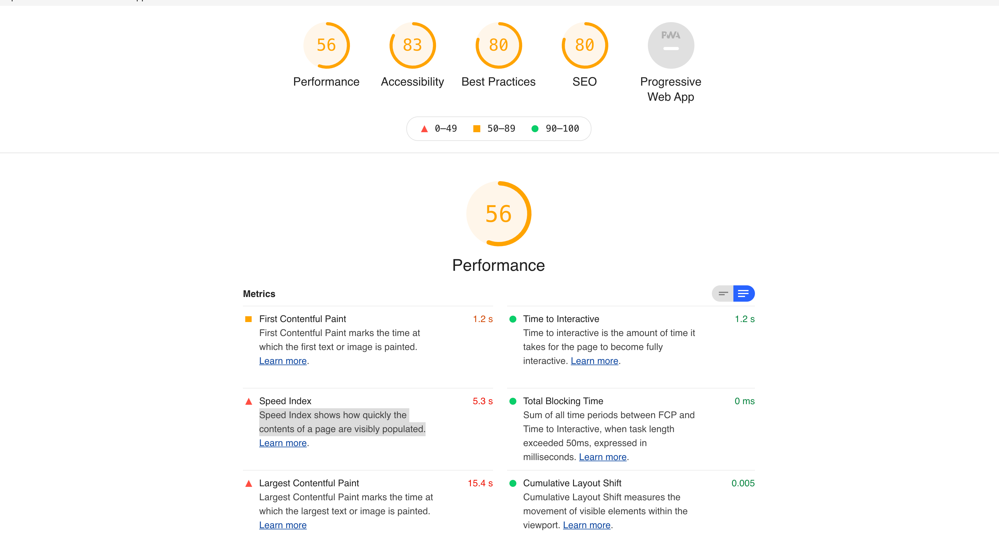
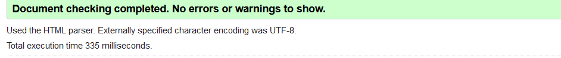
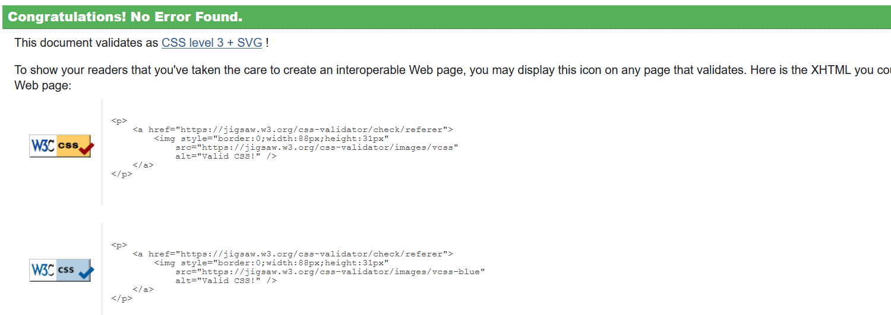
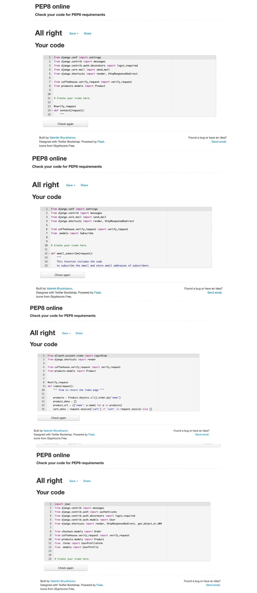
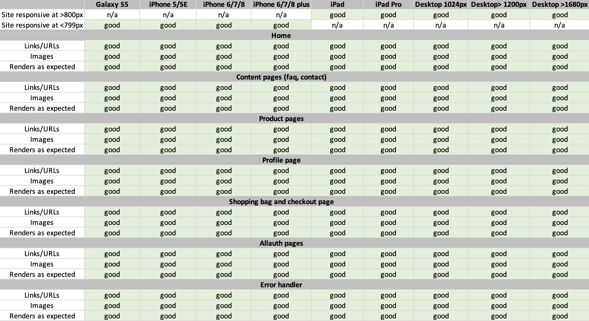
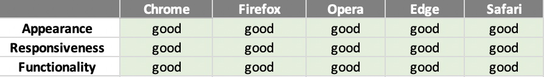

<h1 align="center">
      
</h1>

<h1 align="center">Testing</h1>

## Index 
- <a href="#manual-testing">1. Manual testing</a>
    - <a href="#visitor-goals">1.1 Visitor goals</a>
    - <a href="#consumer-goals">1.2 Consumer goals</a>
    - <a href="#returning-goals">1.3 Returning customer goals</a>
    - <a href="#admin-goals">1.4 Admin goals</a>
- <a href="#automated-testing">2. Automated testing</a>
- <a href="#validators">3. Code validators</a>
- <a href="#responsiveness">4. Responsiveness</a>
- <a href="#browser-compatibility">5. Browser compatibility</a>
- <a href="#other">6. Other</a>
- <a href="#bugs">7. Bugs</a>
- <a href="#future-testing">8. Future testing</a>

---

## 1. Manual testing

**All User Stories are tested with manual testing.**

### 1.1 Visitor goals

1. As a visitor, I want to access the website from any device, so that I can go to the website on desktop, mobile and tablet.

    **Testing**
    - The visitor can visite the website on any device. The website is designed for computer, mobile and tablet. The test for the responsiveness with different devices can be found <a href="#responsiveness">here</a>
    - **Result:** Test passed
2. As a visitor, I want to be able to navigate easily through the website, so I can find everything easily. 

    **Testing**
    - A visitor can navigate throug the website with the navbar on top of the website and through the footer. There is a hamburger menu for mobile visitors, where they can easily can go to every relevant page.
    - The main navigation is through the navbar and contains the following: 
        - Search functionality, where visitors can search for products. The search functionality is based on the title or description of a product. 
        - The profile icon where all profile related pages are places such as the profile page, the login, logout and sign up links. A visitor who is logged in can go to their profile and can logout through the profile icon. Visitors who aren't logged in can login or signup through the profile icon.
        - The shopping bag icon is a link to the shopping bag and you see the amount of dollars that are in your shopping bag. 
        - A link to the our collection. The visitor can go to selected product page or can search coffee based on category. 
        - A link to the blog of the company. 
        - A link to the our story section to homepage. 
    - The footer contains the following: 
        - Links to coffee house. The visitor can go to all collection or can search coffee based on category.
        - Links to profile related pages. A visitor sees relevant links based on whether they are logged in or not. (the same as the profile icon in the navbar) 
        - Links to important information about the order in FAQ. 
        - Link to the contact page, where visitors can contact the owner of the website. 
    - **Result:** Test passed. All links are working and the links are connected to the right page. The search functionality and the profile functionality with showing the right links whether a visitor is logged in or logged out are working correct.

3. As a visitor, I want to access the social media accounts of the company, so I can follow them and see the latest trends and news.

    **Testing**
    - Social media icons are standing at the bottom of the footer where visitors can click on. The social media icons are Twitter, Facebook and Instagram. 
    - **Result:** Test passed: all social media icons are visible for any device and the links lead to the social media websites.

4. As a visitor, I want to sign up for the newsletter, so I can be up to date about the latest news and trends. 

    **Testing**
    - A visitor can sign up of the newsletter at the home page. 
    - A visitor can signup with a email. If the email is new, the email is saved in the database. If the email already exists, there is a notification that the email is already subscribed. 
    - **Result:** Test passed. The newsletter is standing on the home page. And the functionality of checking if the email already exists works good. 

5. As a visitor, I want to know more about the company, so I know what the company is about.

    **Testing**
    - There is a our story section with information about the company, the product and sustainability. 
    - **Result:** Test passed. The page contains company information, product information and information about sustainability.

6. As a visitor, I want to be able to contact the owner of the website, so I can easily ask a question. 

    **Testing**
    - The contact page is found in the footer of the website. 
    - There is a contact page where visitors can send their questions. 
    - On the contact page stands contact information such as the email address and phone number. 
    - **Result:** Test passed. Visitors can fill in the form with any questions or can contact the company through email of phone.

7. As a visitor, I want to see an overview of the collection, so I can see what the website is offering.

    **Testing** 
    - The products page gives an overview of all products. each product has its own page. 
    - The page shows the name ,availability, description, image, increasing and decreasing the quantity of the product before adding to bag.
    - **Result:** Test passed. All products are on their respective pages, each product pages is showing the right results.

8. As a visitor, I want to be able to read more information about the coffee collection, so I can see if the product suits my preferences. 

    **Testing**
    - Visitors can visit the product detail page by clicking on the image of the product. 
    - The product detail page will shows the following information: name, availability, price and description. 
    - Visitors can buy the product and set the quantity of the product if the product is available. Visitors can see if the product is available when they see the green text: available and then use the quantity functionality and can add to shopping bag.   
    - **Result:** Test passed: All product information is on the detail page.

### 1.2 Consumer goals 

9. As a consumer, I want to add products to my shopping bag, so I can buy products. 

    **Testing**
    - The consumer can choose quantity of the product and can add the product to the bag by clicking on the add to bag button. 
    - The quantity can be set from 1 - 99. 
    - The quantity can be modified by typing in the number or by using the -/+ functionality. 
    - The add to bag button will put the product on the shopping bag. 
    - A success toast message shows when the product is added to the shopping bag.
    - The amount of total price is shown in the shopping bag.
    - **Result:** Test passed. All functionalities of the toast messages, add to bag and quantity are working good. 

10. As a consumer, I want to modify my order, so I can make last changes before I order the products.
    
    **Testing**
    - The consumer can modify the quantity of the order on the shopping bag. The consumer can do this by changing the quantity and by clicking update.
    - **Result:** Test passed. The quantity updated when the consumer set another quantity and clicks on update.

11. As a consumer, I want to be able to delete products in my order, so I can remove products that I no longer wish to purchase. 

    **Testing**
    - The consumer can delete the product in the shopping bag by clicking on the trash icon. 
    - **Result:** Test passed. The product is deleted when a consumer clicks on the trash icon.

12. As a consumer, I want to see the total price and shipping costs of my order, so I can see how much I have spent in total. 

    **Testing**
    - The consumer sees the price, shipping cost and the total price of the order. 
    - Free delivery is provided at $45,- or highter.  
    - The total price is automatically deducted from the product price and any shipping costs.
    - **Results:** The product price, shipping costs and total price are automatically calculated and are correct.

13. As a consumer, I want to pay with a card in a safe and secure way, so I know that my payment goes well. 

    **Testing**
    - Consumers can pay with credit card and the payment goes via Stripe payments. 
    - The stripe setup is based on a test environment. A consumer can fill in the number 4242424242424242 to make a successful payment. 
    - A Stripe webhook is implemented for extra secure payments. 
    - The consumer has to fill in personal information and delivery information. 
        - The required fields are full name, email address, phone number, country, town or city and street address 1. 
        - The email has a validator where someone has to use a @. 
        - The country field is a dropdown with all countries. 
    - **Result:** Test pass. The Stripe payments are working fine. And the checkout form is valid. 

14. As a consumer, I want to receive a confirmation email of the order, so I know that the order is successfully received. 

    **Testing**
    - When the purchase is a success,the consumer is redirected to the checkout success page. On the page is a order summary and it will mention that the consumer will receive an email confirmation. 
    - A email confirmation is sent to the consumer. The email is connected with gmail and when a purchase is made, a automatic confirmation is send from emailcoffeehouse@gmail.com to the consumer.
    - **Result:** Test passed. When a consumer makes a purchase a confirmation email is send.

15. As a consumer, I want to create an account, so I can see my profile details and order history. 

    **Testing**
    - A consumer can create an account by signing up. 
    - The consumer can see the personal information, delivery information and the order history. 
    - The consumer can change the delivery information by updating the details and the consumer can change the password.
    - **Results:** Test passed. 

16. As a consumer, I want to know more about shipping, delivery, returns etc., so I know more about when and how my package arrives. 
 
    **Testing** 
    - The consumer can go the FAQ page where all information is displayed. The information is displayed in different sections, such as delivery and returns.
    - The consumer can visit the returning policy page where all information about returns are shown.
    - **Result:** Test passed. The consumer can find all relevant information in the FAQ. Otherwise the consumer can contact the company through the contact page if there are any more questions.

### 1.3 Returning consumer goals 

17. As a returning consumer, I want to login and logout at my account anytime, so I can make an order quickly and so I can see my order history. 

    **Testing**
    - The returning consumer can login and logout through the links in the footer or profile icon in the navbar. 
    - The consumer has a double check for logging out.
    - **Result:** Test passed. The consumer can login and logout easily. 

18. As a returning consumer, I want to reset/change my password (if I forgot it), so I can get access to my profile. 

    **Testing**
    - The password can be changed by clicking the button on the profile page or by the login page. 
    - **Result:** Test passed. The password change functionality is working.

### 1.4 Admin goals

19. As admin, I want to add, modify and delete products, so I manage all products on the website. 

    **Testing**
    - The admin can add a product by clicking on the profile icon and add product. The admin gets a form to fill in and can add a product to the website. 
    - The admin can edit a product by clicking on the product detail page of the product and click on the edit link. The admin gets a filled in form with the details of the product. The details of the product can be updated and be saved. 
    - The admin can remove products by clicking on the product detail page of the product and click on the delete link. A notification will show if the admin is sure to delete the item. The product is deleted by clicking on delete again. 
    - **Results:** Test passed. The add, edit and delete functionallity is working as it should be.

## 2. Automated testing

### Testing apps
Automated testing is used to support the manual testing. The manual testing helped by testing mostly the back-end code with views, models and forms.
The unit tests can be found in the apps in the `test.py`, `views.py` and  `forms.py` files.

### Lighthouse testing

I used the automated tool Lighthouse to test the quality of the web pages. 

**The result:** 

- Note: The performance is rated with a score of 56.
    - The Largest contentful paint is the video in gif format and takes the most seconds. This metrics marks the time at which the largest image or video is painted. 
    - The images are the biggest issue. This has the most to do with the sizes of the original images. The original images are very different in size then on the website and the images are manipulated in a other size. Besides that the images don't have explicit width and height and the cache policy isn't effective.
    - Speed Index is high. It shows how quickly the contents of a page are visibly populated. 

## 3. Validators

- **[HTML Validator](https://validator.w3.org/):** No errors found.

- **[CSS Validator](https://jigsaw.w3.org/css-validator/):** No errors found.

- **[JS Hint](https://jshint.com/):** No errors found.
    

- **[Python validator | PEP8](http://pep8online.com/):** No errors found

    **Results:** No errors found!

---

## 4. Responsiveness 
- Responsiveness of the game is tested with [Chrome DevTools](https://developers.google.com/web/tools/chrome-devtools) and [Responsive Design Checker](https://www.responsivedesignchecker.com/).
- The game is tested on the following devices: 
    - Desktop: 1024px, 1366px, 1440px, 1600px and 1680px. 
    - Mobile & Tablet: Galaxy S5, iPhone 5/SE, iPhone 6/7/8, iPhone 6/7/8 plus, iPhone x, iPad and  iPad Pro

---

## 5. Browser compatibility

--- 

## 6. Other

- During developing the website the debugger in `settings.py` was set to `debug=True`. The **debugger** showed errors and allowed me to find the errors quickly and to fix it.
- Custom error pages for error 500 shows up in the same design as the website. 
- Url access/ security is test. The results: 
    - Pages that don't exist are headed to a 500 page. 
    - Users who visit pages that require login while the user is not logged in will be directed to the login page.
    - Users who want to visit superuser access pages are getting redirected to the login page.

--- 

## 7. Bugs 

1. A bug was found in the password reset page of the website. 
    - I checked that a different password in new password and confirm password is needed and that was the reason for error.
2. A bug was found in products page I was unable to increase or decrease quantities of products. 
    - Fixed by implementing the button feature. 
---

## 8. Future testing 

Testing is a big part that has to be done after project creation. In the future with more time and knowledge, I would like to improve testing and make the quality of the project better. 
In the future I would like to improve two areas: 
- I would like to improve the automated testing with testing the apps looking at `views`, `models`, and `forms'. 
- I would like to improve the results of the lighthouse scores, especially the performance score. The performance score is 56 and I would like to improve that score by going through the requirements and improve these elements.

---

[Go to README.md file](README.md).
